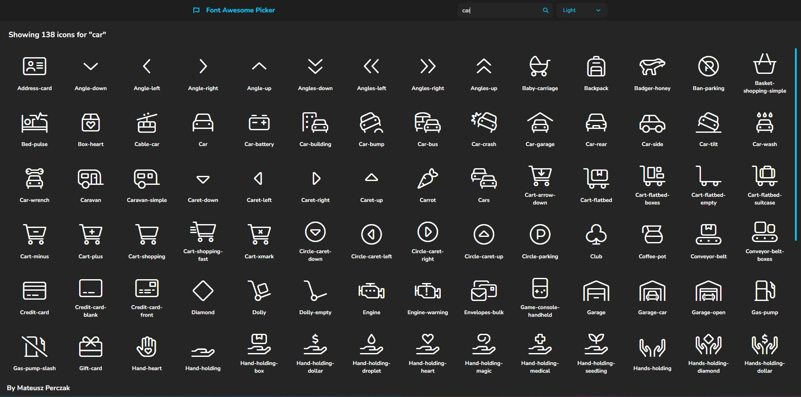

# Custom Font Awesome Picker




## Libraries

- React
- Emotion
- Framer-motion
- Vite
- Lodash
- RxJS
- Font Awesome

## Running this project

1. Install all dependencies.

```sh
pnpm i
```

2. Start vite development server.

```sh
pnpm dev
```
